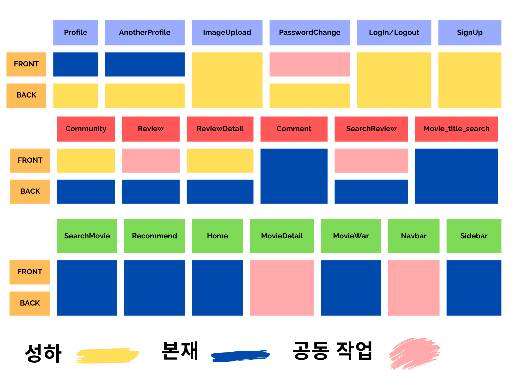
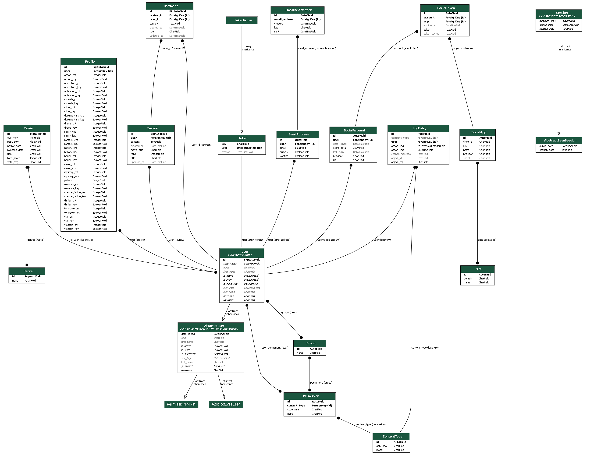
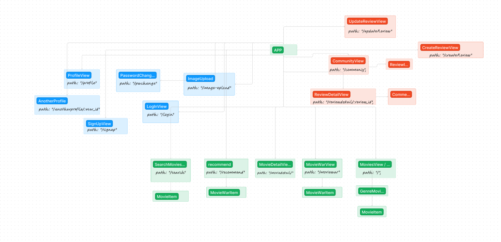

사용 아키텍처 : Django REST Framework & Vue
API : TMDB

i. 팀원 정보 및 업무 분담 내역
팀장 : 구본재
팀원 : 류성하 
역할 분담 : 기능별로 분담

ii. 목표 서비스 구현 및 실제 구현 정도
목표 서비스 :  유저 행동과 유저가 선호하는 장르정보를 기반으로 유저가 선호하는 영화 추천 기능을 제공하고 영화 관련해서 게시판기능을 가지고 이외에도 커뮤니티 기능을 강화하기 위해서 영화 관련 흥미를 주는 시스템을 제공하고, 유저에게 영화 추천용 점수와 별개로 점수를 부여해 이 점수로 칭호, 레벨, 랭킹 등을 부여, 특정 행동이나 횟수를 만족했을 때 업적을 주는 시스템으로 유저에게 동기를 부여하고 유저간 상호작용을 위해 유저가 좋아요한 영화리스트를 서로 공유하는 기능을 추가하는 서비스를 구상했습니다.

실제 구현 정도 : 영화 추천 기능이나 게시판 기능은 어느정도 완성했지만 영화 흥미를 주는 요소는 적용하지 못한게 많습니다. 영화전쟁을 통해 유저가 자신이 좋아하는 영화 장르를 선택할 수 있게하여 선호하는 영화정보를 받을 수 는 있지만 게시판 기능과 시너지를 줄 수 있는 요소를 만들지 못한게 아쉽습니다.

iii. 데이터베이스 모델링 (ERD)

컴포넌트 구성도

iv. 영화 추천 알고리즘에 대한 기술적 설명
영화 상세 정보에 들어가거나, 프로필에 선호장르를 정하거나, 영화 올림픽으로 영화를 선정하는 과정에서 얻는 장르 포인트를 기록하고
그 정보를 기반으로 정렬하여 가장 높은 점수를 가진 순서대로 정렬하고 그 다음 점수 순서대로 정렬하여 최상위 10개 중 3개를 랜덤하게 보여주는 방식을 사용했습니다.

v. 서비스 대표 기능에 대한 설명
서비스 대표 기능은 영화전쟁(MovieWar)가 있으며 자신이 어떤 영화를 좋아하는지 알지 못하는 경우에 사용하면 유용합니다
32개의 영화를 무작위로 선정하여 2개씩 짝을 지어 하나씩 선택하는 구조입니다. 이 경우 유저의 선택을 돕기위해 포스터와 해당 포스터에 마우스를 올리면 영화 정보를 제공하는 방식을 사용하여 좀 더 유저의 선택의 유의미한 결과를 가져올 수 있도록 했습니다. 최종적으로는 1개가 남아 해당 장르의 포인트가 유저 데이터베이스에 저장되고 이는 유저가 영화 추천 알고리즘을 사용할 경우에 유저의 흥미도가 반영되어 영화 목록을 출력하는데 도움이 됩니다.

vi. 배포 서버 URL (배포했을 경우)
vii. 기타 (느낀 점, 후기 등)

처음에 기본기능을 완성하고 추가기능을 구현하는 방향으로 접근했기 때문에
기획서를 따로 문서화 하지 않았고 이로 인해 추가기능을 구현할 때도 따로 문서화하는 작업을 진행하지 않아서 이후 작업을 할 때에는 효율적인 작업을 수행하는데 문제가 있었습니다.

다음 프로젝트에서는 여러 툴 들을 활용하고 적극적으로 기록해야겠다는 생각이 들었습니다.

5.17

1. 역할 분담 : 기능별로 분담
2. 기본 기능을 먼저 완성한 후 추가기능을 구현하는 방향으로 접근
   API : DMDB
   슬로건: 못해도 된다 즐겁게 하자 
   팀 이름은 fish & potato

5.18
본재:
영화 홈 화면 작업
성하:
유저 프로필 작업

5.19
본재:
커뮤니티 기능 작업
검색 기능 구상
성하:
git hub 머지작업 및 프로필 기능 보완

5.20~ 5.21
본재:
영화 검색, 게시판 검색, 영화 트레일러 추가
성하:
프로필 모델을 이용해서 유저 프로필 이미지 추가  

5.22
본재:
네비게이션바 수정 
페이지 이름 정하기
영화 디테일에 장르 추가
추천 알고리즘 구상 및 영화 올림픽 구상
성하:
프로필 초기설정 및 오류 수정

5.23
본재:
추천 알고리즘 구상 및 월드컵 기능 완성
추천 알고리즘 조회(1점), 선호도(10점), 월드컵(5점)으로 장르 별 점수 추가
각 유저 프로필 마다 점수를 추가하고 해당 점수를 각 영화의 장르와 매치하여 영화 정보를 제공
성하:
게시글 + CSS

5.24
본재:
유저 프로필에 선호도 버튼 추가
추천 알고리즘 완성
상단 바에 검색기능을 사용시 같은 장소로 이동하기 때문에 오류가 발생
검색 기능 창으로 이동하면 상단의 검색 창을 안보이게 설정

성하:
영화 좋아요 작업
CSS + 다른 사람 프로필 보기
수제 머지 및 수정 작업

5.25
본재:
어나더 프로필,프로필,비밀번호 수정 css
리뷰 영화 타이틀 입력시 관련 영화 정보를 하단에 추가
영화 사이트 로고 추가 
상단에 링크 언더바 제거
편한 이동을 위한 사이드바 추가
성하:
게시판 CSS 작업
게시글 수정, 삭제 내부로 이동
상단바 프로필 이미지수정 및 로그인, 로그아웃, 프로필 등 접근성 향상
영화 디테일에 좋아요 추가 작업
깃 머지 작업 및 오류 수정 작업
